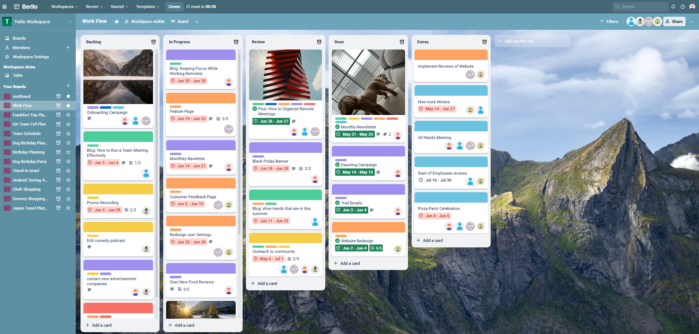

# Brello – Frontend

Brello is a Trello-inspired project management tool built with React. It supports real-time collaboration, task reordering, and AI-generated boards.

**Live Demo:** [https://berllo.onrender.com](https://berllo.onrender.com/b/682b120c80be8be01782eadb/Work%20Flow/)
  

**Backend Repo:** [Brello Backend](https://github.com/senpaiharde/berllo-backend)
---

## 🚀 Features

- Create boards, lists, and tasks
- Drag and drop to reorder lists and tasks
- Real-time collaboration with multiple users
- AI-assisted board generation
- JWT-based user authentication
- Fully responsive design

---

## 🛠 Tech Stack

- **React** (JavaScript)
- **Redux Toolkit** (`createSlice`, `createAsyncThunk`)
- **Axios** for API communication
- **Socket.IO Client** for real-time updates
- **Modular Component Architecture**

---
